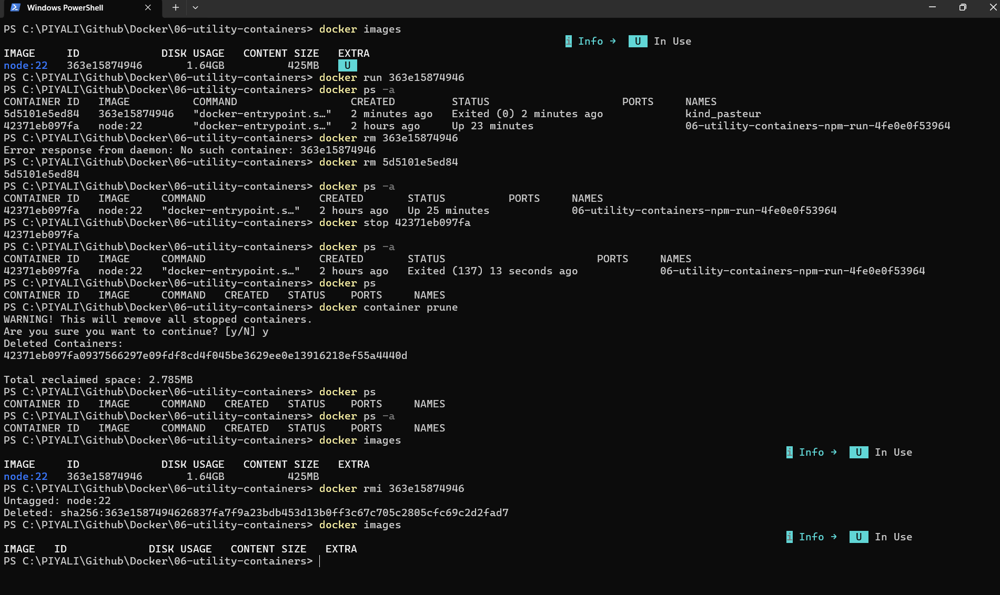

# 01 — Images & Containers

An introduction to the two fundamental building blocks of Docker: **images** (read-only templates) and **containers** (running instances of those images).

---

## Concepts

| Term | Description |
|---|---|
| **Image** | A read-only, layered filesystem snapshot built from a Dockerfile. |
| **Container** | A live, isolated process created from an image. |
| **Layer** | Each instruction in a Dockerfile adds an immutable layer to the image. |
| **Registry** | A remote store for images (e.g. Docker Hub, GHCR). |

---

## Key Commands

```bash
# Pull an image from Docker Hub
docker pull <image>:<tag>

# List locally available images
docker images

# Run a container (pulls image if not present)
docker run <image>

# Run interactively with a pseudo-TTY
docker run -it <image> /bin/sh

# Run in detached (background) mode
docker run -d <image>

# List running containers
docker ps

# List all containers (including stopped)
docker ps -a

# Stop a running container
docker stop <container-id|name>

# Remove a stopped container
docker rm <container-id|name>

# Remove an image
docker rmi <image>:<tag>

# Remove all stopped containers
docker container prune
```



---

## docker pull <image>:<tag>
Breakdown:
```
docker    → Docker CLI
pull      → download an image
node      → image/repository name
22        → tag/version
```
Docker will look in Docker Hub by default:
```
Docker Hub
    │
    │ docker pull node:22
    ▼
┌──────────────┐
│ node:22      │
│ Docker image │
└──────────────┘
    │
    ▼
Your local Docker image store
```

**You can verify it:**
```
docker image ls
```
You should see something similar to:
```
REPOSITORY   TAG   IMAGE ID
node         22    abc123...
```

**What is the tag?**

The tag identifies a particular image variant/version.
```
docker pull node:22
docker pull node:20
docker pull node:lts
docker pull node:22-alpine
```
These can represent different images.

If you write:
```
docker pull node
```
Docker uses the default tag:
```
node:latest
```

## Image Lifecycle

```
Dockerfile ──► docker build ──► Image ──► docker run ──► Container
                                              │
                                         docker stop
                                              │
                                         (stopped) ──► docker rm
```

---

## Tips

- Use specific tags (e.g. `node:20-alpine`) instead of `latest` to keep builds reproducible.
- Images are **immutable**; every change creates a new layer.
- Stopped containers still occupy disk space — run `docker container prune` regularly during development.
- Use `docker inspect <container>` to see low-level runtime details.

---

## References

- [Docker overview](https://docs.docker.com/get-started/overview/)
- [docker run reference](https://docs.docker.com/engine/reference/run/)
- [docker images reference](https://docs.docker.com/engine/reference/commandline/images/)
