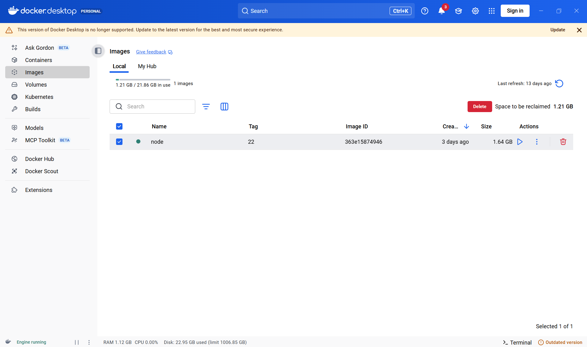
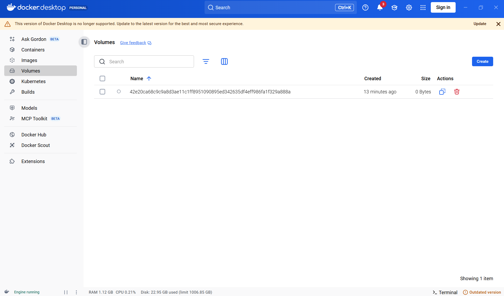
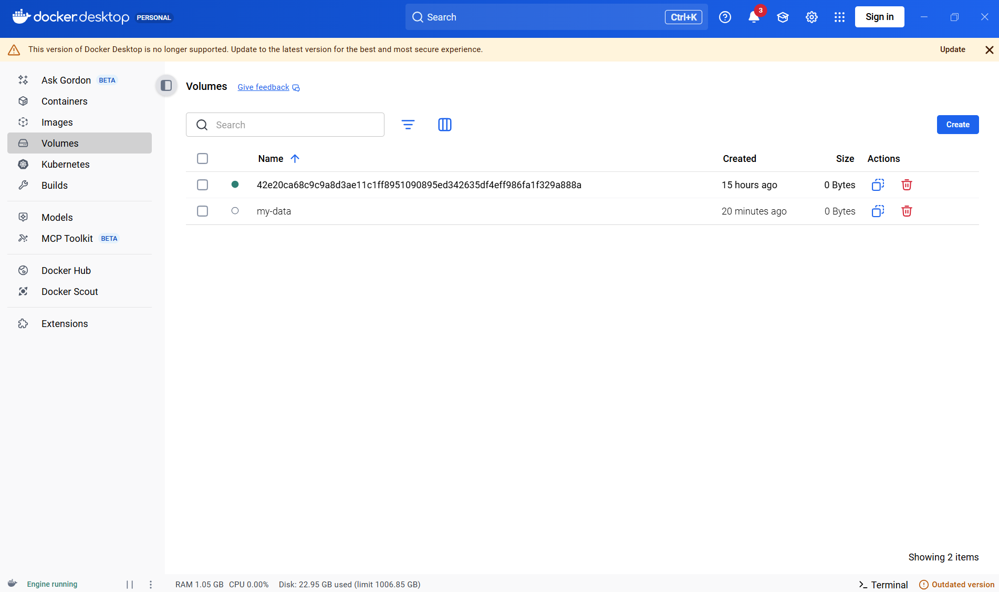
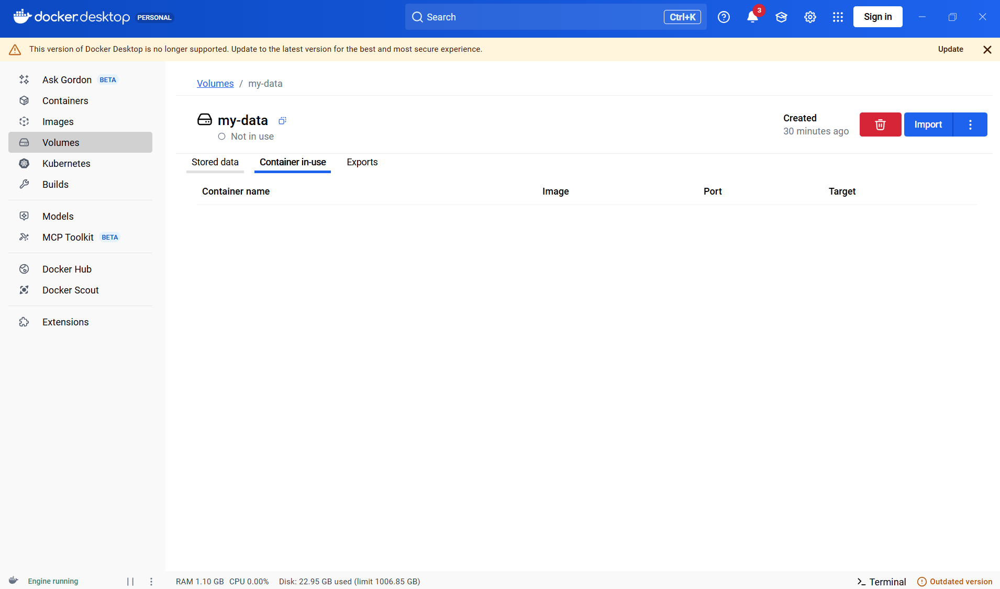
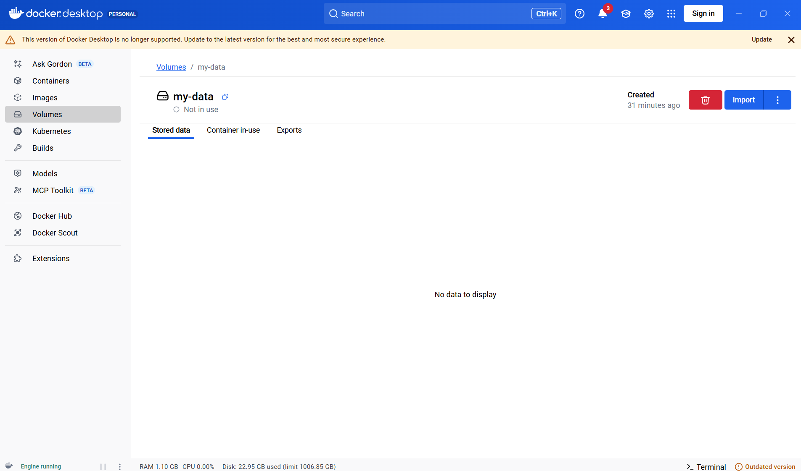
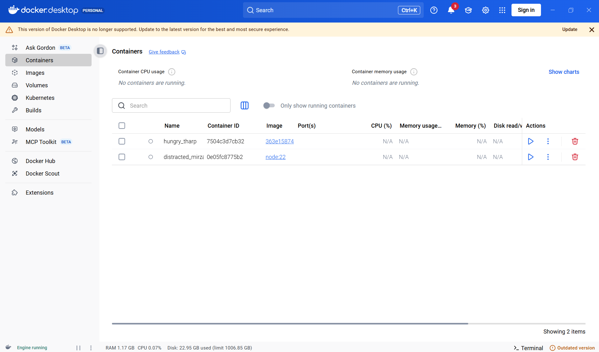
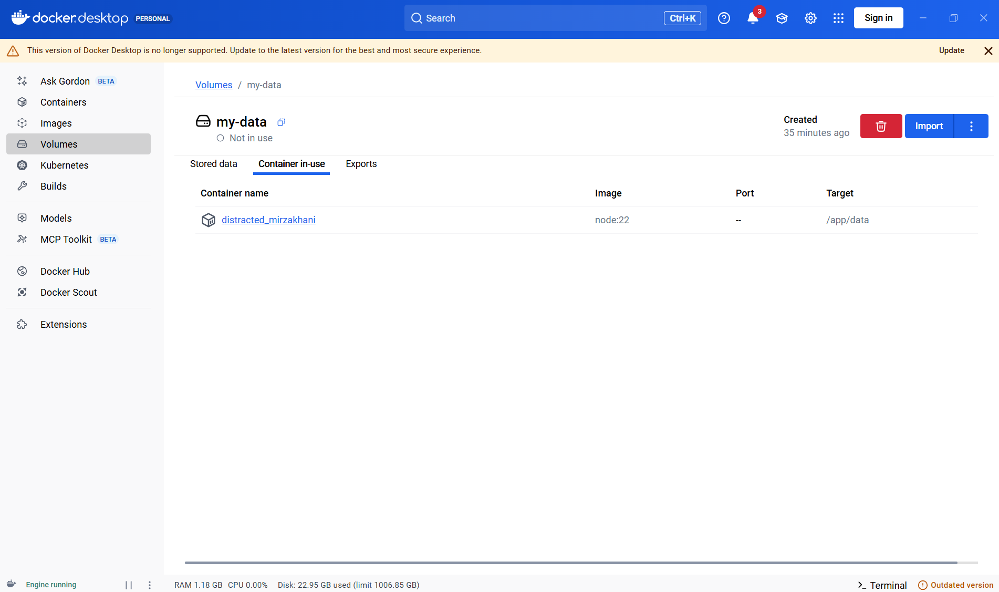
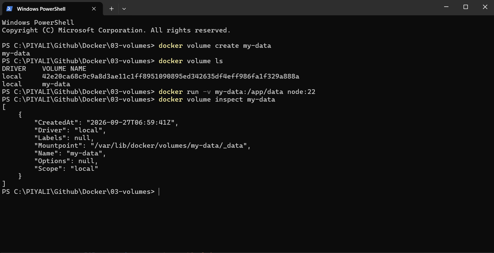
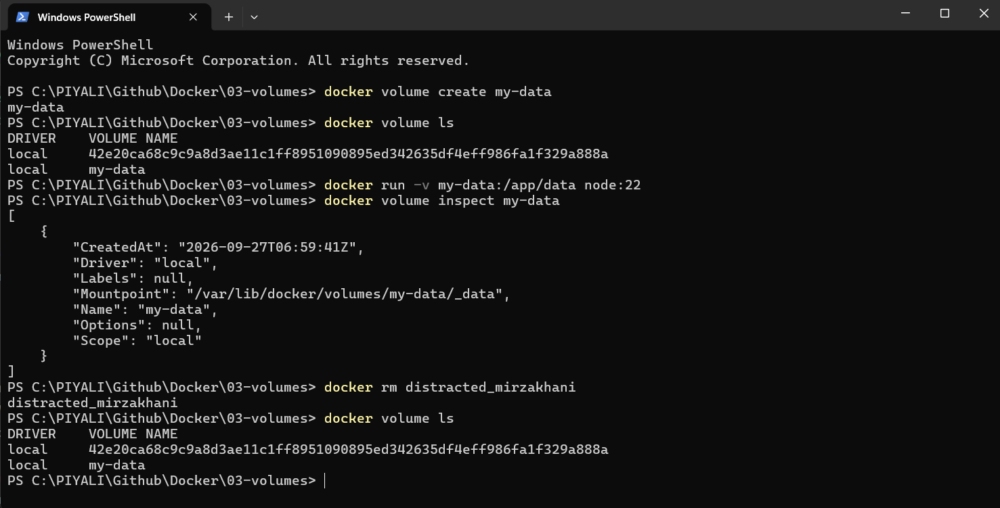
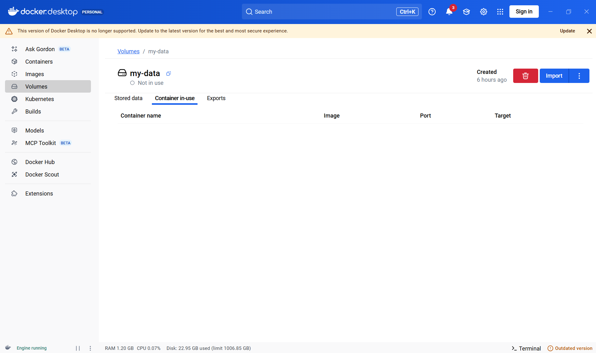

# 03 — Volumes & Bind Mounts

**Volumes** are the recommended mechanism for persisting data generated by and used by Docker containers. They are managed by Docker and stored outside the container's writable layer.

---

## Why Volumes?

- Data written to a container's writable layer is **lost** when the container is removed.
- Volumes persist data independently of the container lifecycle.
- Volumes can be shared between multiple containers.
- Docker manages the storage location on the host (`/var/lib/docker/volumes/`).

---

## The Three Storage Types — Quick Syntax

You have three ways to use the `-v` flag with `docker run`:

```bash
# 1. Anonymous volume — no name assigned, Docker-managed path
docker run -v /app/data my-image

# 2. Named volume — you assign the name before the colon
docker run -v data:/app/data my-image

# 3. Bind mount — absolute host path before the colon
docker run -v /path/to/code:/app/code my-image
```

> **The rule of thumb:** if what's before the colon starts with `/` (or `C:\` on Windows), it's a **bind mount**. If it's a short name, it's a **named volume**. If there's no colon at all, it's an **anonymous volume**.

---

## Feature Comparison

| Feature                        | Anonymous Volume                         | Named Volume                 | Bind Mount                 |
|-------------------------------|------------------------------------------|------------------------------|----------------------------|
| Docker syntax                 | `-v /app/data`                           | `-v data:/app/data`          | `-v /host/path:/app/data`  |
| Name assigned by you?         | ❌                                        | ✅                            | N/A                        |
| Host path controlled by you?  | ❌                                        | ❌                            | ✅                          |
| Tied to a specific container? | Effectively yes                          | ❌                            | ❌                          |
| Survives container restart?   | ✅                                        | ✅                            | ✅                          |
| Survives container removal?   | ❌ (removed with `--rm`)                  | ✅                            | ✅                          |
| Share between containers?     | ❌ Not intended                           | ✅                            | ✅                          |
| Easy to edit from host?       | ❌                                        | ❌                            | ✅                          |
| Best use                      | Isolating / protecting container data    | Persistent application data  | Development / source code  |

---

## Mental Model

```
Anonymous Volume  →  -v /app/data
   "Give this container some Docker-managed storage."

Named Volume      →  -v mydata:/app/data
   "Give me reusable Docker-managed persistent storage."

Bind Mount        →  -v C:\project:/app
   "Mount THIS exact folder from my computer."
```

**Interview shortcut:**
```
Anonymous  = container-associated, temporary storage
Named      = reusable, persistent, Docker-managed storage
Bind mount = host-controlled folder mapped into the container
```

---

## Anonymous Volumes — Deep Dive

An anonymous volume is created when you specify only a container path (no name):

```bash
docker run -v /app/data my-image
```

Key characteristics:
- **Attached to a container** — if the container is removed (or `--rm` is used), the volume is removed too.
- **Survives restarts** — data is safe across `docker stop` / `docker start` cycles.
- **Cannot be shared** across containers (not designed for it).
- Creates a real folder on the host under `/var/lib/docker/volumes/`, so container data is **outsourced to the host file system** — not stored in the container's writable layer. This can provide small performance benefits.
- Useful for **locking in data that already exists in the container** so it cannot be overwritten by a bind mount layered on top.

```dockerfile
# Dockerfile — declare an anonymous volume at build time
VOLUME ["/app/data"]
```

> Prefer named volumes over anonymous volumes when you need the data to outlive the container.

---

## Named Volumes — Deep Dive

A named volume is created by prefixing a name before the colon:

```bash
docker run -v data:/app/data my-image
```

Key characteristics:
- **Not tied to any specific container** — survives container removal.
- Can be **shared across multiple containers** by mounting the same volume name.
- Must be removed explicitly with `docker volume rm`; it is never deleted automatically.
- **Cannot be created in a Dockerfile** — must be declared at `docker run` time or in `docker-compose.yml`.

---

## Bind Mounts — Deep Dive

A bind mount maps a folder from your host machine directly into the container:

```bash
docker run -v /path/to/code:/app/code my-image   # Linux / macOS
docker run -v C:\project:/app my-image            # Windows
```

Key characteristics:
- **You control the host path** — Docker does not manage it.
- **Not tied to a container** — survives removal of any container.
- Data can only be deleted by removing it on the **host** (no Docker command deletes it).
- Files are immediately visible and editable from the host, making bind mounts ideal for **live development workflows**.
- Can be shared across containers by mounting the same host path.

---

## Volume Types at a Glance

| Type              | Syntax                     | Managed by            |
|-------------------|----------------------------|-----------------------|
| **Named volume**  | `my-volume:/app/data`      | Docker                |
| **Anonymous volume** | `/app/data`             | Docker (auto-named)   |
| **Bind mount**    | `/host/path:/app/data`     | User                  |
| **tmpfs mount**   | `--tmpfs /app/tmp`         | Memory only (Linux)   |

---

## Key Commands

```bash
# Create a named volume
docker volume create my-data

# List all volumes
docker volume ls

# Inspect a volume (shows mount point on host)
docker volume inspect my-data

# Remove a volume
docker volume rm my-data

# Remove all unused volumes
docker volume prune
```

---

## Using Volumes with docker run

```bash
# Named volume — Docker creates it automatically if it doesn't exist
docker run -v my-data:/app/data my-image

# Anonymous volume — useful for excluding a subdirectory from a bind mount
docker run -v /app/node_modules my-image

# Read-only volume
docker run -v my-data:/app/data:ro my-image

# Long (--mount) syntax — preferred for clarity
docker run \
  --mount type=volume,source=my-data,target=/app/data \
  my-image

# Bind mount with --mount syntax
docker run \
  --mount type=bind,source="$(pwd)"/src,target=/app/src \
  my-image
```

---

## Creating an Anonymous Volume while Running an Existing Image
```bash
# Pull node image
docker pull node:22

# List locally available images
docker images
```

**You can see already existing node image**
```
IMAGE     ID             DISK USAGE   CONTENT SIZE   EXTRA
node:22   363e15874946       1.64GB          425MB
```

**Run the image with an anonymous volume**
```bash
# Create a Anonymous volume
docker run -v /app/data 363e15874946
```
does not mean "create a volume inside the image."

The volume is associated with the container, and /app/data is the mount point inside that container.

Think:
```
                 IMAGE
              node:22
                 │
                 │ docker run
                 ▼
            CONTAINER
        ┌────────────────┐
        │                │
        │ /app/data ◄────┼──── Anonymous Volume
        │                │
        └────────────────┘
```
And because you're using an existing node:22 image, you don't need to build a new image just to create the volume.

### Here:
That command does mount a volume into a container, but the command is creating the volume implicitly as an anonymous volume.
```
docker run -v /app/data 363e15874946
```
**Breakdown:**
```
docker run
   │
   ├── -v /app/data
   │      │
   │      └── Mount an anonymous volume at /app/data
   │
   └── 363e15874946
          └── Image ID
```
Because you specified only:
```
-v /app/data
```
and didn't provide a volume name, Docker creates an anonymous volume.

The important thing is:
> **/app/data is always the container-side mount point.**
> **What changes is what gets mounted there: an anonymous volume, named volume, or host directory.**

### Conceptually:
```
Docker
│
├── Image
│   └── node:22
│
└── Container
    │
    └── /app/data
           ▲
           │
           │ anonymous volume
           │
           └── 42e20ca68c9c9...
```
Then:
```
docker volume ls
```
may show:
```
DRIVER    VOLUME NAME
local     42e20ca68c9c9a8d3ae11c1ff...
```



### Why is it called anonymous?

Because you didn't give the volume a name.

**Compare:**
```
# Anonymous
docker run -v /app/data node:22
```
**versus:**
```
# Named
docker run -v my-data:/app/data node:22
```
The difference is:
```
Anonymous:
-v /app/data
   └── only container path
```
Named:
```
-v my-data:/app/data
   │       └── container path
   └────────── volume name
```

---

## Create a Named Docker Volume
```bash
# Create a named volume
docker volume create my-data
```

```bash
# List all volumes
docker volume ls
```

### You can see the list of volumes
```
DRIVER    VOLUME NAME
local     42e20ca68c9c9a8d3ae11c1ff8951090895ed342635df4eff986fa1f329a888a
local     my-data
```

**You explicitly created this one. Therefore it is a named volume.**
```
my-data
   ↑
   └── name chosen by you
```




### You can now mount it into a container:
```
docker run -v my-data:/app/data node:22
```
You previously created:
```
docker volume create my-data
```
So Docker has:
```
Docker Volume
└── my-data
```

**When you ran:**
```
docker run -v my-data:/app/data node:22
```
Docker created a new container from the node:22 image.

Your container was given the generated name:
```
distracted_mirzakhani
```

**The volume was mounted**

This part:
```
-v my-data:/app/data
```
means:
```
my-data
   │
   │ mounted to
   ▼
/app/data
```

**So the complete relationship is:**
```
             node:22 IMAGE
                   │
              docker run
                   │
                   ▼
       ┌──────────────────────┐
       │ Container            │
       │ distracted_mirzakhani│
       │                      │
       │ /app/data            │
       │      ▲               │
       └──────┼───────────────┘
              │
              │ mount
              │
         ┌────┴─────┐
         │ my-data  │
         │ VOLUME   │
         └──────────┘
```




### Why would we use two steps?
The separate approach is useful when you want to manage the volume independently from the container.

**Step 1**
```
docker volume create my-data
             │
             ▼
       Docker Volume
          my-data
```

**Step 2**
```
docker run -v my-data:/app/data node:22
             │
             ▼
        Container
        /app/data
             │
             ▼
        my-data volume
```
This makes the lifecycle clearer:
> **Volume lifecycle ≠ Container lifecycle**

**For example, you can:**
```
docker volume create my-data
```
**Then use the same volume with multiple containers:**
```bash
docker run -v my-data:/app/data container1
docker run -v my-data:/app/data container2
```
The volume remains even if you remove the containers.

**In your learning example**

If you're simply demonstrating "named volume mounting", this is enough:
```
docker run -v my-data:/app/data node:22
```
Docker will effectively do:
```
Does my-data exist?
       │
   ┌───┴───┐
   │       │
  YES      NO
   │       │
   │    Create it
   │       │
   └───┬───┘
       ▼
Mount my-data → /app/data
```
So:
| Command                                                             | Purpose                             |
| ------------------------------------------------------------------- | ----------------------------------- |
| `docker volume create my-data`                                      | Explicitly create/manage the volume |
| `docker run -v my-data:/app/data node:22`                           | Mount the named volume              |
| `docker run -v my-data:/app/data node:22` when volume doesn't exist | **Create + mount automatically**    |

### Why does Docker Desktop say "Not in use"?

This is important.

Your screenshot/table shows:
```
my-data — Not in use
```
That means the container exists, but it is probably stopped.

docker run creates and starts a container, but the node:22 image doesn't have a long-running command in this situation.

So the container starts → Node process finishes/exits → container becomes stopped.

The volume still exists.

### Check the volume

Run:
```bash
docker volume inspect my-data
```
Docker will show information about it, including its storage location managed by Docker.


### Removing Container will not delete Volume
**Before**


```bash
docker rm distracted_mirzakhani
```


**After**



---

## docker-compose Example

```yaml
services:
  app:
    image: node:20-alpine
    volumes:
      - .:/app                          # bind mount for live code changes
      - /app/node_modules               # anonymous volume to protect node_modules

  db:
    image: postgres:16-alpine
    environment:
      POSTGRES_PASSWORD: secret
    volumes:
      - db-data:/var/lib/postgresql/data  # named volume for persistent DB data

volumes:
  db-data:   # declares the named volume (Docker manages the path)
```

---

## Backup & Restore a Named Volume

```bash
# Backup: archive volume contents to a tar file on the host
docker run --rm \
  -v my-data:/data \
  -v $(pwd):/backup \
  alpine \
  tar czf /backup/my-data-backup.tar.gz -C /data .

# Restore
docker run --rm \
  -v my-data:/data \
  -v $(pwd):/backup \
  alpine \
  tar xzf /backup/my-data-backup.tar.gz -C /data
```

---

## When to Use Which

| Scenario | Recommended type |
|---|---|
| Database data that must survive container re-creation | Named volume |
| Live source code editing during development | Bind mount |
| Protecting a subdirectory from being overwritten by a bind mount | Anonymous volume |
| Sharing config/secrets between multiple containers | Named volume or bind mount |
| Temporary scratch space that doesn't need to persist | Anonymous volume or `tmpfs` |

---

## References

- [Docker volumes documentation](https://docs.docker.com/storage/volumes/)
- [Bind mounts documentation](https://docs.docker.com/storage/bind-mounts/)
- [Choose the right storage driver](https://docs.docker.com/storage/)
