# 04 — Bind Mounts

**Bind mounts** map a file or directory on the **host machine** directly into a container. Unlike volumes, the host path is fully controlled by you — not Docker.

> [!NOTE]
> You cannot add a new bind mount to an already-created container.
> You have to remove the existing container & recreate it with bind mount
> Docker interprets `docker run` as: "Create a NEW container from my-image and start it".

---

## Volumes vs Bind Mounts

| Feature | Named Volume | Bind Mount |
|---|---|---|
| Managed by | Docker | You (host path) |
| Location on host | `/var/lib/docker/volumes/` | Any path you choose |
| Ideal for | Production data persistence | Local development / live reload |
| Cross-platform | ✅ | ⚠️ Path format differs on Windows |

---

## Real-World Use Cases of Bind Mounts

Bind mounts shine in scenarios where the **host filesystem and the container need to stay in sync in real time**. Below are the most common production and development patterns you'll encounter.

### 1. Live-Reload Local Development

Mount your source code directory into the container so every file save is instantly visible inside the running container — no rebuild required.

```bash
# Node.js app — nodemon watches for changes on the host
docker run -v $(pwd):/app -w /app node:20 npx nodemon index.js
```

> **Why it matters:** A full `docker build` can take 30–120 seconds. With a bind mount, a file save is reflected in under a second, making the inner dev loop as fast as running the app natively.

---

### 2. Injecting Configuration Files at Runtime

Supply environment-specific config (nginx, PostgreSQL, Redis, etc.) without baking it into the image, keeping images generic and reusable.

```bash
# Nginx — inject a custom site config from the host
docker run -v $(pwd)/nginx.conf:/etc/nginx/nginx.conf:ro -p 80:80 nginx

# PostgreSQL — override the default postgres config
docker run -v $(pwd)/postgresql.conf:/etc/postgresql/postgresql.conf:ro postgres
```

> **Why it matters:** One image, many environments. Staging and production can share the same image but receive different config files at container start.

---

### 3. Real-Time Log Access & Analysis

Bind-mount the container's log directory to the host so existing log-rotation tools, monitoring agents (Filebeat, Fluentd), or just a plain `tail -f` work directly.

```bash
docker run -v /var/log/myapp:/app/logs my-image

# On the host — watch logs in real time
tail -f /var/log/myapp/app.log
```

> **Why it matters:** No need to `docker exec` into a container or use `docker logs`. Log aggregation pipelines running on the host pick up log files as if the app ran natively.

---

### 4. Sharing Build Artifacts Between Host & Container

Use Docker as a hermetic build environment while making the output (compiled binaries, dist bundles, test reports) available on the host immediately after the build.

```bash
# Compile a Go binary inside a container, output lands on the host
docker run --rm -v $(pwd)/output:/out golang:1.22 \
  sh -c "go build -o /out/myapp ./..."

# Build a React app and place the dist/ folder on the host
docker run --rm -v $(pwd):/app -w /app node:20 npm run build
```

> **Why it matters:** Your host doesn't need the exact compiler or toolchain version. The container provides the reproducible build environment; the host receives the artifact.

---

### 5. Database Data Directory (Development Only)

Persist a database's data directory on the host so you can inspect, back up, or version individual SQL dump files between container restarts.

```bash
docker run -v $(pwd)/pgdata:/var/lib/postgresql/data postgres:16
```

> ⚠️ **Production note:** For production databases prefer **named volumes** over bind mounts — named volumes are portable and Docker manages permissions correctly across platforms.

---

### 6. Providing SSL/TLS Certificates

Inject TLS certificates from a host-managed certificate store (e.g. Let's Encrypt / Certbot) into a web server container.

```bash
docker run \
  -v /etc/letsencrypt/live/example.com/fullchain.pem:/certs/fullchain.pem:ro \
  -v /etc/letsencrypt/live/example.com/privkey.pem:/certs/privkey.pem:ro \
  -p 443:443 nginx
```

> **Why it matters:** Certbot renews certificates on the host. Because the mount is live, the container always serves the latest certificate without a redeploy.

---

### 7. Hot-Reloading CI/CD Pipeline Scripts

Mount pipeline or deployment scripts into a tooling container so the CI system can update the script and re-run without rebuilding the image.

```bash
docker run --rm \
  -v $(pwd)/scripts:/scripts \
  -v $(pwd)/reports:/reports \
  python:3.12 python /scripts/run_tests.py
```

---

### 8. Docker Socket Mount (Advanced — Privileged Use)

Mount the Docker daemon socket to allow a container to control Docker itself. Used by CI systems (Jenkins, GitLab Runner) and tools like Portainer.

```bash
docker run -v /var/run/docker.sock:/var/run/docker.sock docker:cli docker ps
```

> ⚠️ **Security warning:** Mounting the Docker socket gives the container **root-equivalent access** to the host. Only use this in trusted, controlled environments.

---

### Summary

| Use Case | Host Path | Container Path | Mode |
|---|---|---|---|
| Live code reload | `./src` | `/app/src` | `rw` |
| Config injection | `./nginx.conf` | `/etc/nginx/nginx.conf` | `ro` |
| Log collection | `/var/log/myapp` | `/app/logs` | `rw` |
| Build artifacts | `./output` | `/out` | `rw` |
| Dev database | `./pgdata` | `/var/lib/postgresql/data` | `rw` |
| TLS certificates | `/etc/letsencrypt/…` | `/certs` | `ro` |
| CI scripts | `./scripts` | `/scripts` | `ro` |
| Docker socket | `/var/run/docker.sock` | `/var/run/docker.sock` | `rw` |

---

## Basic Usage

```bash
# Short -v syntax  (host:container) in Linux/macOS Bash
docker run -v $(pwd)/src:/app/src my-image

# Short -v syntax  (host:container) in Windows PowerShell
docker run -v ${PWD}/src:/app/src my-image

# Long --mount syntax (preferred for clarity) in Linux/macOS Bash
docker run --mount "type=bind,source=$(pwd)/src,target=/app/src" my-image

# Long --mount syntax (preferred for clarity) in Windows PowerShell
docker run --mount "type=bind,source=${PWD}/src,target=/app/src" my-image

# Read-only bind mount in Linux/macOS Bash
docker run -v $(pwd)/config:/app/config:ro my-image

# Read-only bind mount in Windows PowerShell
docker run -v ${PWD}/config:/app/config:ro my-image
```

```
Linux/macOS Bash → $(pwd)
Windows PowerShell → ${PWD}
Windows CMD → %cd%
```

> **Both commands create the same type of Docker bind mount**

|                     | `-v`          | `--mount`     |
| ------------------- | ------------- | ------------- |
| Bind mount          | ✅             | ✅             |
| Host directory      | `${PWD}/src`  | `${PWD}/src`  |
| Container directory | `/app/src`    | `/app/src`    |
| Result              | Same          | Same          |
| Syntax              | Short         | Explicit      |
| Readability         | Less explicit | More explicit |

```
-v syntax
       │
       ▼
HOST/src ───────────────► CONTAINER:/app/src


--mount syntax
       │
       ▼
source=HOST/src ────────► target=/app/src
```

---

## Two common syntaxes for creating a Docker Bind Mount
```
┌─────────────────────────────────────────────────────────────────────┐
│                 BIND MOUNT — TWO SYNTAXES                          │
└─────────────────────────────────────────────────────────────────────┘

1️⃣ -v syntax + Node web application

docker run --rm -p 3000:3000 \
  -v $(pwd)/src:/app/src \
  my-node-image


2️⃣ --mount syntax + Node web application

docker run --rm -p 3000:3000 \
  --mount type=bind,source=$(pwd)/src,target=/app/src \
  my-node-image


3️⃣ -v syntax + normal container

docker run \
  -v $(pwd)/src:/app/src \
  my-image


4️⃣ --mount syntax + normal container

docker run \
  --mount type=bind,source=$(pwd)/src,target=/app/src \
  my-image
```

**The important thing is that -p and --rm have nothing to do with bind mounts.**
```
docker run
   │
   ├── --rm ──────────► Container lifecycle
   │
   ├── -p 3000:3000 ─► Network/port mapping
   │
   └── -v ... ────────► Bind mount
          OR
       --mount ... ───► Bind mount
```

**So the actual two bind-mount syntaxes are simply:**
```
-v $(pwd)/src:/app/src
```
and
```
--mount type=bind,source=$(pwd)/src,target=/app/src
```
Everything else in your commands is independent of the bind mount.

### 1. Short -v syntax
```bash
# Linux/macOS Bash, where $(pwd) expands to the current directory
docker run -v $(pwd)/src:/app/src my-image

# In Windows PowerShell
docker run -v "${PWD}/src:/app/src" my-image
```

Format:
```
-v <host-path>:<container-path>
```
So:
```
$(pwd)/src  →  /app/src
     HOST          CONTAINER
```
Docker mounts your host's src directory into /app/src inside the container.

### 2. Long --mount syntax
```bash
# Linux/macOS Bash, where $(pwd) expands to the current directory
docker run --mount "type=bind,source=${pwd}/src,target=/app/src" my-image

# In Windows PowerShell
docker run --mount "type=bind,source=${PWD}/src,target=/app/src" my-image
```
Here you explicitly specify:
```
type=bind
source=$(pwd)/src
target=/app/src
```
This is more verbose but makes the configuration easier to understand, especially in enterprise/Docker Compose environments.

### 3. Read-only bind mount

With -v:
```
docker run -v $(pwd)/config:/app/config:ro my-image
```
The :ro means read-only.
```
Host:       ./config
              │
              │  read-only
              ▼
Container:  /app/config
```
The container can read the configuration but cannot modify files in that mounted directory.

The equivalent --mount syntax is:
```
docker run \
  --mount type=bind,source=$(pwd)/config,target=/app/config,readonly \
  my-image
```

### Quick comparison
| Syntax                 | Example                                          | Main advantage        |
| ---------------------- | ------------------------------------------------ | --------------------- |
| `-v`                   | `-v ./src:/app/src`                              | Short and convenient  |
| `--mount`              | `--mount type=bind,source=./src,target=/app/src` | Explicit and readable |
| `-v ...:ro`            | `-v ./config:/app/config:ro`                     | Read-only             |
| `--mount ... readonly` | `--mount type=bind,...,readonly`                 | Read-only + explicit  |

> **Important: -v and --mount are not two different types of mounts. They are two syntaxes for configuring the same bind mount.**

---

## Live-Reload Development Workflow

Bind-mount source code into the container so changes on the host are instantly visible without rebuilding the image.

```bash
# Node.js with nodemon watching for file changes
docker run -it --rm \
  -v ${PWD}:/app \
  -v /app/node_modules \       # anonymous volume — keeps container's node_modules
  -p 3000:3000 \
  my-node-dev-image
```

> The anonymous volume `/app/node_modules` prevents the bind mount from overwriting the modules installed inside the image.

---

## Source Code Example

### A. Run Nodejs application - In a real application, the container DOES stay running

1. **Create package.json**
```bash
npm init -y
```

2. **Create a Dockerfil**

3. **Build image**
```bash
docker build -t my-image .
```
**What happens during the build**
```
Your Windows project
04-bind-mounts/
│
├── package.json
├── package-lock.json
└── src/
    └── app.js
        │
        │ docker build
        ▼
Docker image
/app/
│
├── package.json       ← COPY package*.json ./
├── package-lock.json
├── node_modules/      ← RUN npm install
└── src/
    └── app.js         ← COPY . .
```
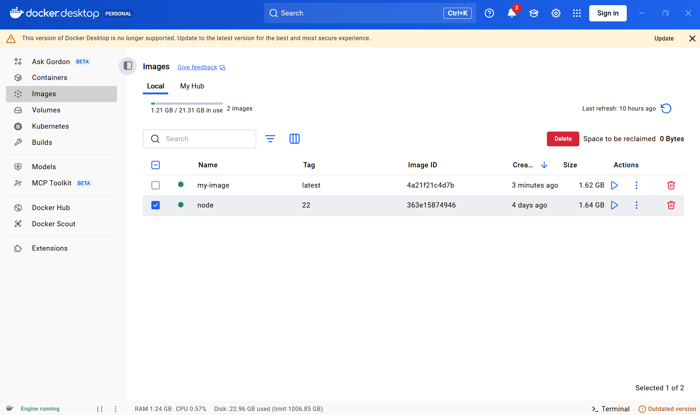

4. **Then use the actual image name `my-image` to create & run the container `my-app`:**
```bash
docker run --name my-app -v ${PWD}/src:/app/src my-image
```
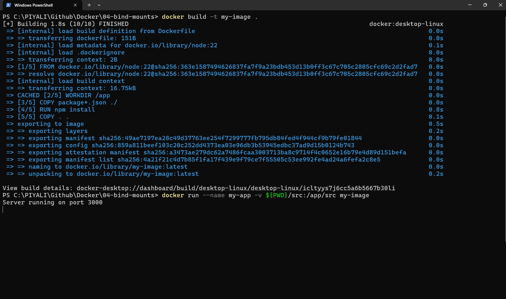
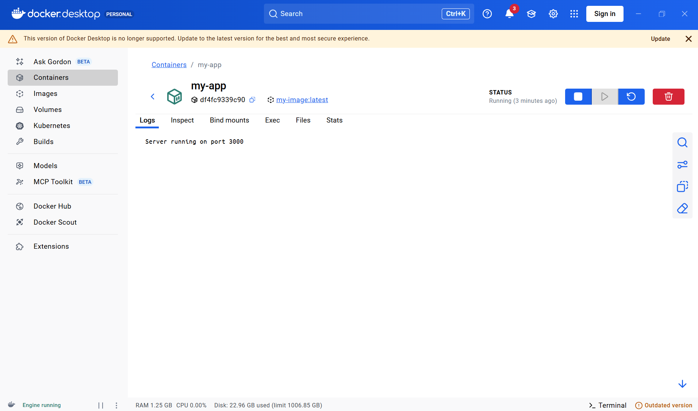
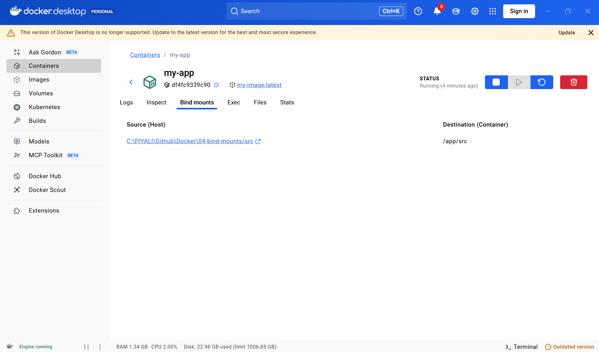
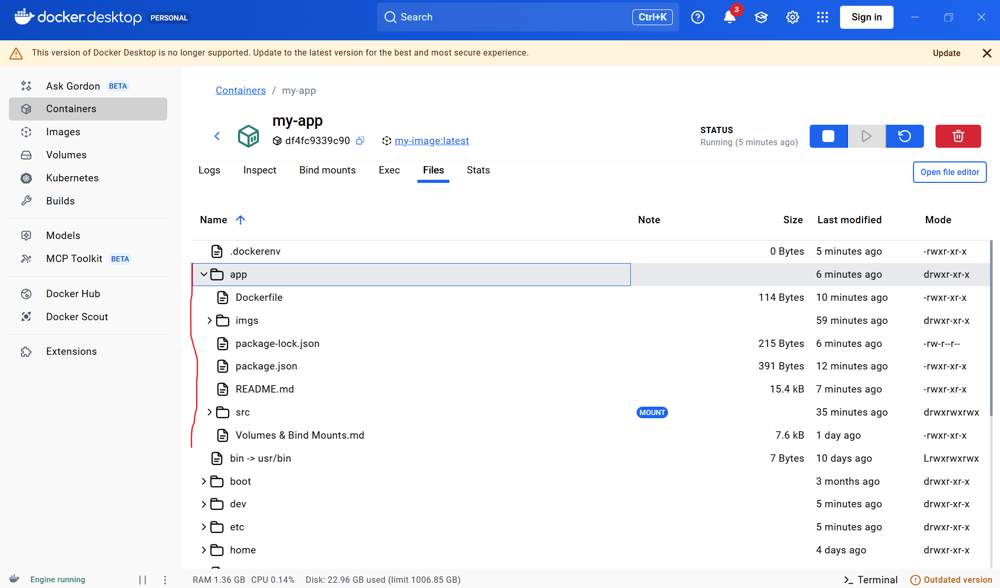

5. **So your architecture becomes:**
```
HOST                              CONTAINER
────────────────────────────────────────────────
04-bind-mounts/
│
├── package.json  ──COPY────────→ /app/package.json
│
├── package-lock  ──COPY────────→ /app/package-lock.json
│
└── src/ ─────────bind mount───→ /app/src/
                                      │
                                      ├── app.js
                                      └── data/
                                          └── user.json
```
This is actually a very good example of why bind mounts are useful for development: your dependencies/package metadata can be part of the image, while your frequently changing source code is mounted from your host.

6. **Create product.json on the HOST**
Go to:
```
C:\PIYALI\Github\Docker\04-bind-mounts\src\data
```
Create:
```
product.json
```
with:
```
{
  "id": 101,
  "name": "Laptop",
  "price": 75000
}
```
Your host now has:
```
04-bind-mounts/
├── Dockerfile
├── package.json
└── src/
    └── data/
        ├── user.json
        └── product.json
```

7. **If container is running. Go inside the container:**
```bash
docker exec -it my-app bash
```
Now you're inside:
```bash
root@xxxxx:/#
```
Go to the mounted directory:
```bash
cd /app/src/data
```
Check files:
```bash
ls
```
You should see:
```
product.json
```
Now:
```
cat product.json
```
You should get:
```
{
  "id": 101,
  "name": "Laptop",
  "price": 75000
}
```
🎯 This proves the bind mount is working.

8. **Another way to verify - If container is running**
```bash
docker exec my-app cat /app/src/data/product.json
```
or
```bash
docker exec my-app ls -la /app/src/data
```
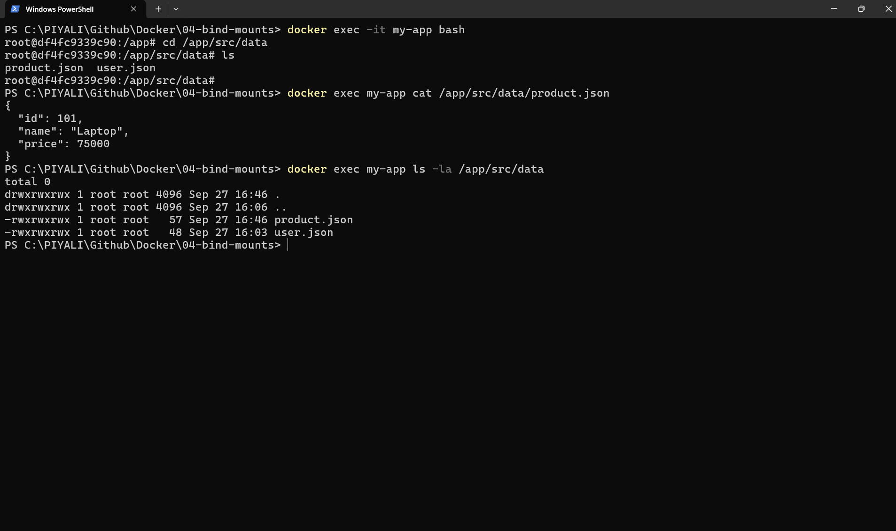

#### Why you don't see it in Docker Desktop
Docker Desktop's container UI isn't necessarily a live file browser for the mounted directory. Refreshing the container page doesn't mean Docker Desktop will display every file under /app/src.
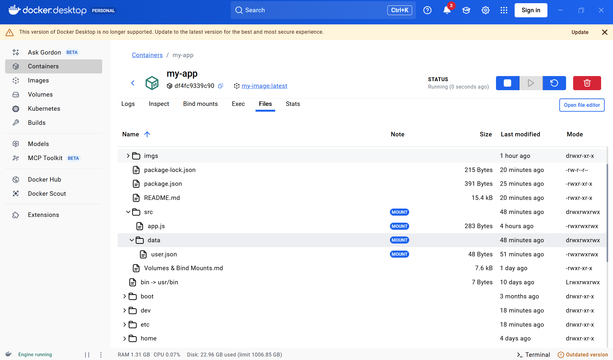

Think of it as:
```
                 Bind Mount
Windows ───────────────────────── Container
  │                                  │
  │ src/data/product.json            │
  │                                  │
  └──────────────────────────────────┘
```
Docker Desktop is managing the container, but the file itself lives on your Windows filesystem.

If you want to see it visually

Open Windows Explorer:
```
C:\PIYALI\Github\Docker\04-bind-mounts\src\data
```
You should see:
```
product.json
```
Then verify the container side with:
```bash
docker exec my-app ls /app/src/data
```
You should get:
```
product.json
```
That is the strongest proof that the bind mount is working.

If you specifically want to see it through Docker Desktop

Open your container:
```
Containers
   ↓
bind-test
```
Look for a Files / Exec / terminal option depending on your Docker Desktop version. If there's an interactive terminal, run:
```
ls -la /app/src/data
```
But don't expect the normal Containers list refresh to make product.json appear as a Docker Desktop container item.

The container is the Docker object; product.json is just a file inside its mounted filesystem.

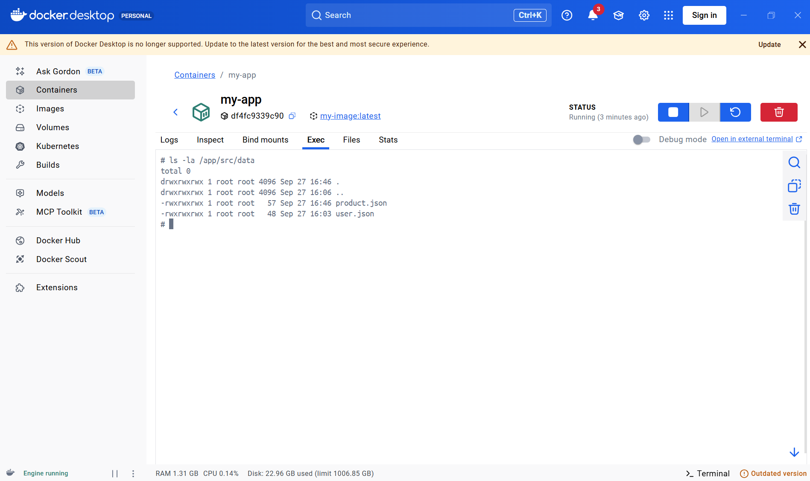
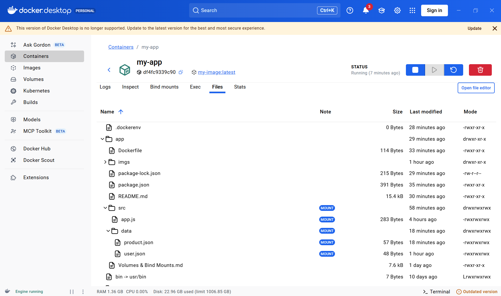


#### Why this is useful for development
> **you do not need to run docker run every time to insert/update data in a bind mount.**

The key idea is:
> **The bind mount connects a host folder and a container folder. You can modify the host folder directly, even when the container is stopped.**

Now Docker creates this mapping:
```
HOST                         CONTAINER

src/  ────────────────────►  /app/src/
 │                              │
 │                              │
 │  app.js                      │ app.js
 │  data/                       │ data/
 │                              │
 └──── changes appear here ────┘
```

**Now add data from your host**

For example, on Windows:
```
src/data/user.json
```
Create:
```
{
  "name": "Piyali",
  "role": "developer"
}
```
You don't run docker run again.

The container immediately sees:
```
/app/src/data/user.json
```
because both locations point to the same underlying files.

1. Create the file on Windows

Go to:
```
C:\PIYALI\Github\Docker\04-bind-mounts\src
```
Create:
```
src/
└── data/
    └── user.json
```
Put this inside user.json:

{
  "name": "Piyali",
  "role": "developer"
}
2. Docker sees the same file

Because of:
```
-v ${PWD}/src:/app/src
```
Docker maps:
```
Windows                                      Container
─────────────────────────────────────────────────────────
src/data/user.json  ──────────────────────► /app/src/data/user.json
```
So inside the container:

ls /app/src/data

you'll see:

user.json

And:

cat /app/src/data/user.json

returns:

{
  "name": "Piyali",
  "role": "developer"
}

#### This is one of the main reasons bind mounts are commonly used for development:
```
             Developer
                 │
                 ▼
            VS Code
                 │
          edits src/
                 │
                 ▼
        ┌────────────────┐
        │   Host folder  │
        │     /src       │
        └───────┬────────┘
                │
          bind mount
                │
                ▼
        ┌────────────────┐
        │    Container   │
        │    /app/src    │
        └────────────────┘
                │
                ▼
          Application
```

**So you can:**
```
Edit code
   ↓
Save
   ↓
Host src/ changes
   ↓
Container /app/src changes
   ↓
Application sees changes
```

**docker run is only needed initially**

For example:
```
docker run --name my-app -v ${PWD}/src:/app/src node:22
```
After that:
```
docker stop node:22
```
and later:
```
docker start node:22
```
You don't recreate the container.

### B. Simple utility/container task
1. Check your existing images
```bash
docker images
```
It will give
```
IMAGE     ID             DISK USAGE   CONTENT SIZE   EXTRA
node:22   363e15874946       1.64GB          425MB    U
```

**or If you haven't created an image yet, create a Dockerfile & build the image**
```bash
docker build -t my-node-app .
```

2. Then use the actual image name:
```bash
docker run -v ${PWD}/src:/app/src node:22
```
Use when you don't need to access a network service from your host.

**Why created a container? i already have a container which was created from the image**
The important distinction is:
```
IMAGE
  ↓ docker run
NEW CONTAINER
  ↓
Mount your host directory
```
So when you execute:
```
docker run -v "${PWD}/src:/app/src" node:22
```
Docker does not modify or reuse your existing container. It creates another container from node:22 and applies the bind mount to that new container.

Suppose you already have:
```
node:22 IMAGE
    │
    ├── container-1   ← existing container
    │
    └── container-2   ← created by your new docker run
                         └── /app/src → Host/src
```
Your existing container-1 doesn't automatically get the new bind mount.

**If the existing container was created without the bind mount**

You generally need to recreate it:
```
docker rm my-node-container
```
Then create it again with the mount:
```
docker run -it --name my-node-container -v "${PWD}/src:/app/src" node:22
```

**This command retrieves detailed metadata about the container, including its storage and mount configurations.**
```
docker inspect <container_name_or_id>
```

> [!NOTE]
> you cannot add a new bind mount to an already-created container.

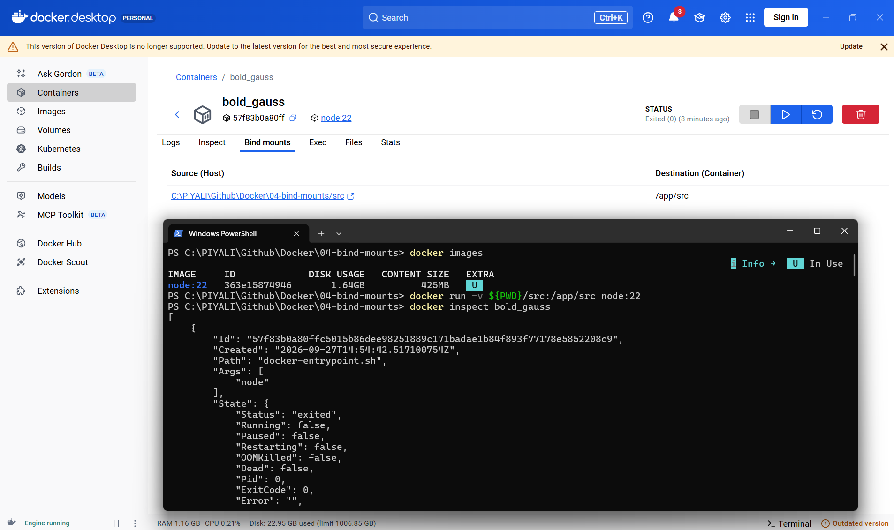

3. Then create mount again
```bash
docker run --mount "type=bind,source=${PWD}/src,target=/app/src" node:22
```
Another containe is created
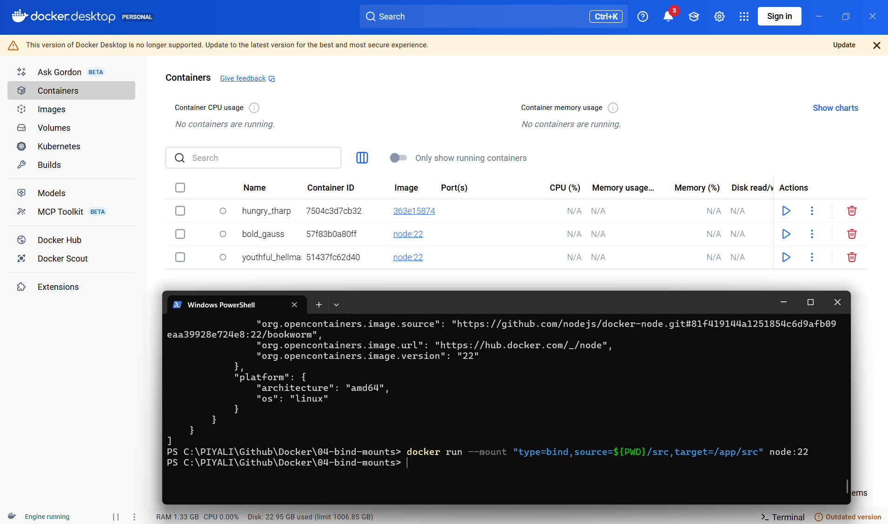
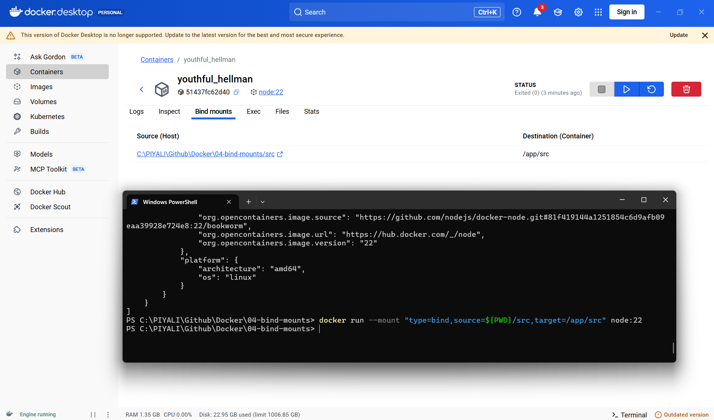

4. `docker start youthful_hellman` container is stopping immediately after running
> **Docker doesn't keep a container alive. The application process keeps the container alive.**

**Remember this rule**

> **Container ≠ Virtual Machine**

A VM can sit there doing nothing.

A Docker container needs a running foreground process:
```
Node application running  → container stays UP
nginx running             → container stays UP
tail -f /dev/null         → container stays UP
bash running              → container stays UP
process exits             → container STOPS
```
The container is not running because node:22 by itself doesn't have a long-running application to execute. The container is behaving correctly.

When you created the container from:
```
node:22
```
the image's default command starts Node.js.

If Node has nothing to do / its process exits, then:
```
Node process exits
       ↓
PID 1 exits
       ↓
Container stops
```
A Docker container is considered running only while its main process (PID 1) is running.

That's why you see:
```
STATUS
Exited (0)
```
0 is especially important: it means the process finished successfully, not that Docker necessarily encountered an error.


---


## docker-compose Example

```yaml
services:
  web:
    build: .
    ports:
      - "3000:3000"
    volumes:
      - ./src:/app/src                 # bind mount — live reload
      - /app/node_modules              # anonymous volume — preserve deps
    command: ["npm", "run", "dev"]
```

---

## Windows Path Notes

On Windows with PowerShell, use `${PWD}` instead of `$(pwd)`:

```powershell
docker run -v ${PWD}/src:/app/src my-image
```

With Docker Desktop on Windows, bind mounts go through WSL 2 or the Docker VM — file change notifications (inotify) may be slower than on Linux/macOS.

---

## Security Consideration

Bind mounts grant the container **direct access to the host filesystem** at the specified path. Avoid mounting sensitive directories (e.g. `/`, `/etc`, `~/.ssh`) and always use `:ro` (read-only) where write access is not needed.

---

## Common Patterns

| Use case | Mount |
|---|---|
| Live source code reload | `-v $(pwd):/app` |
| Inject config file | `-v $(pwd)/my.conf:/etc/app/my.conf:ro` |
| Share compiled artifacts | `-v $(pwd)/dist:/app/dist` |
| Preserve container deps | `-v /app/node_modules` (anonymous) |

---

## References

- [Bind mounts documentation](https://docs.docker.com/storage/bind-mounts/)
- [Use volumes vs bind mounts](https://docs.docker.com/storage/#choose-the-right-type-of-mount)
