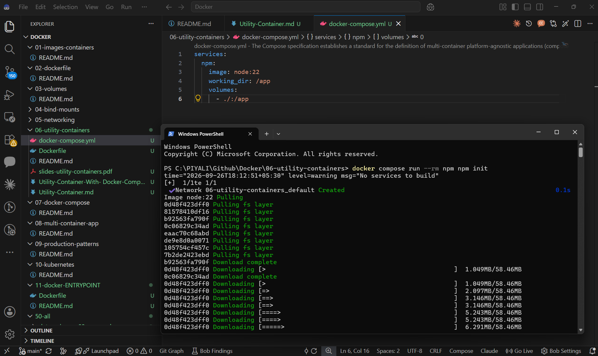
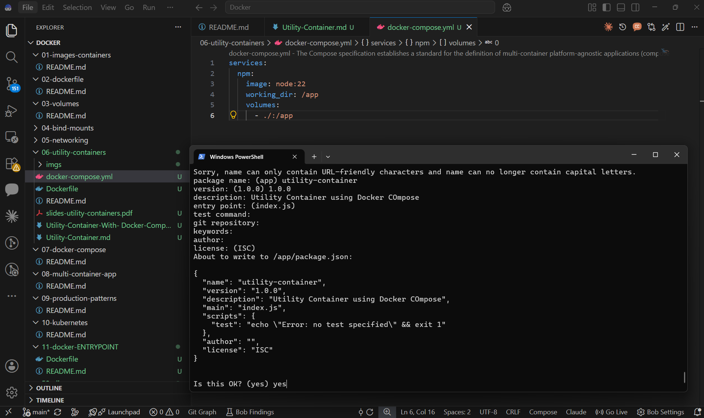
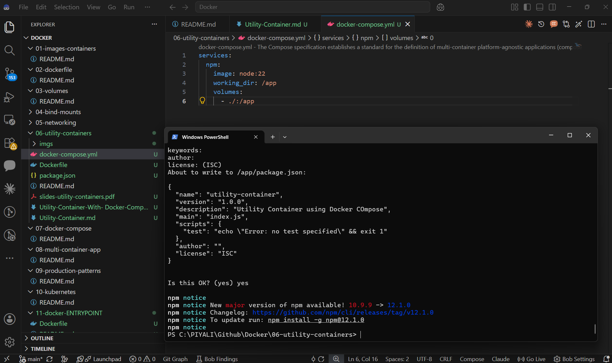
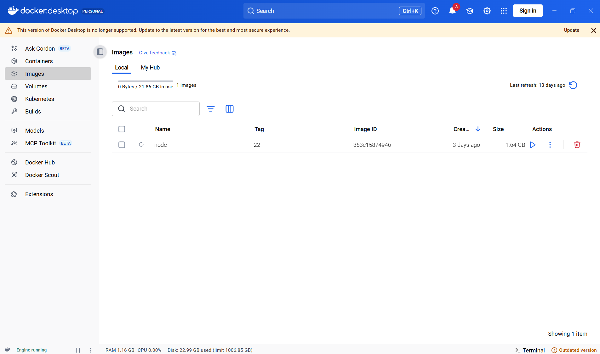
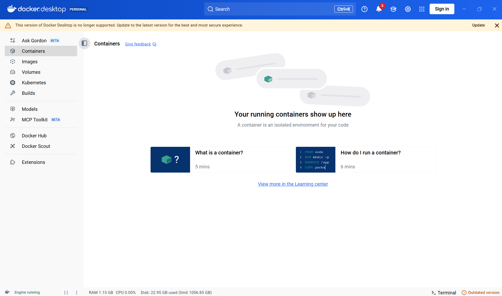
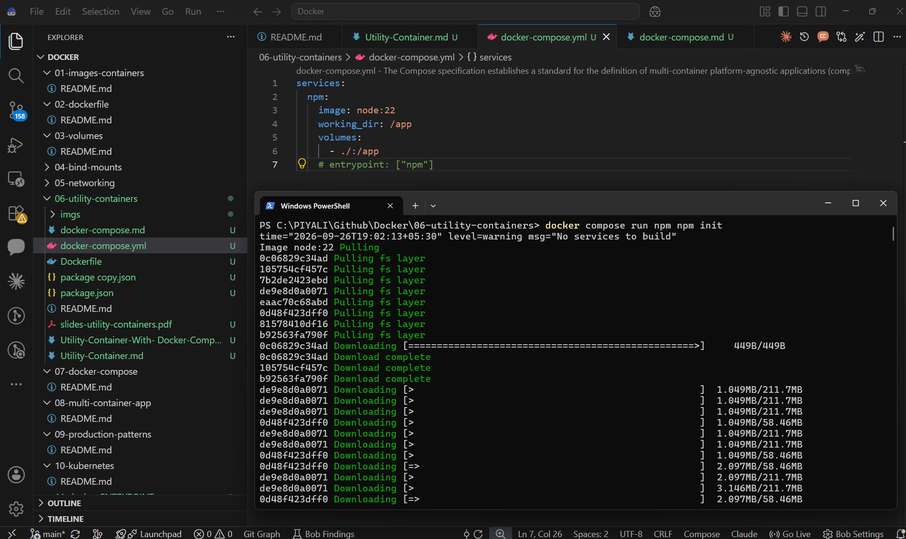
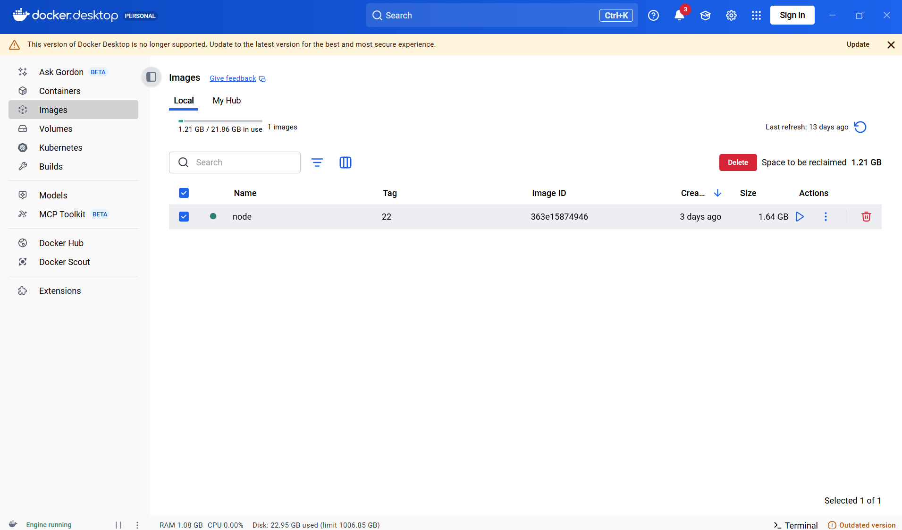
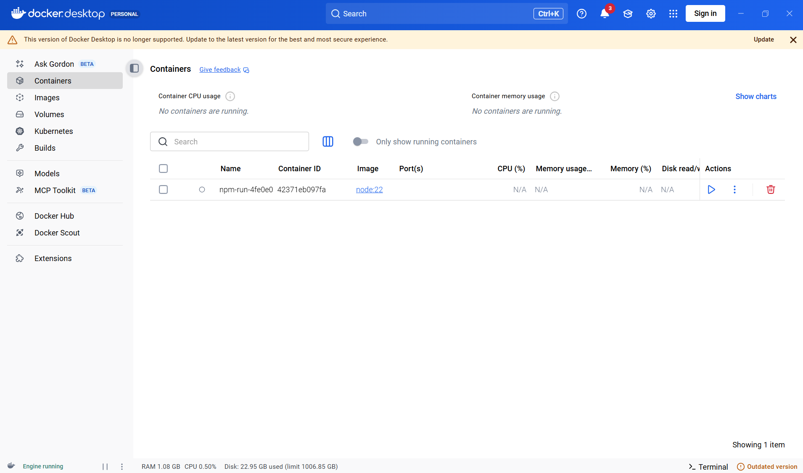
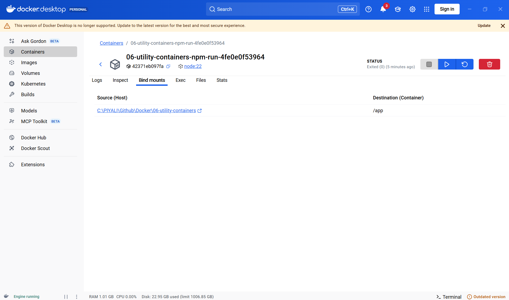
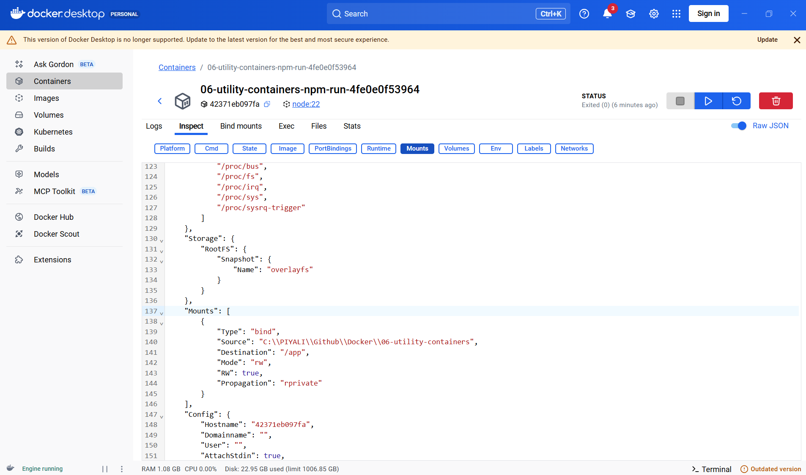

# Create package.json using npm init inside Docker Utility Container

## Case 1 : Using service name at runtime command - npm = service name
### 1. Create this docker-compose.yml
```
services:
  npm:
    image: node:22
    working_dir: /app
    volumes:
      - ./:/app
```
Your folder:
```
06-utility-containers/
├── docker-compose.yml
└──
```

### 2. Run npm init

**From that folder:**
```
docker compose run --rm npm npm init
```



**You'll see:**
```
This utility will walk you through creating a package.json file.
package name: (app)
version: (1.0.0)
description:
entry point: (index.js)
...
Is this OK? (yes)

Enter your values.
```


### 3. Result

**After completion:**
```
06-utility-containers/
├── docker-compose.yml
└── package.json
```


**The important part is:**
```
docker compose run --rm npm npm init
                         │   │
                         │   └── command executed inside container
                         └────── service name

docker compose run --rm npm npm init
                     │   │
                     │   └── WHAT to run
                     └────── WHICH container configuration
```
So Docker says:
> **"Start the service called npm, then execute npm init inside that container."**

**What happens internally**
```
Windows Host
│
│ docker compose run --rm npm npm init
│
▼
┌─────────────────────────────┐
│ Temporary Node.js Container │
│                             │
│ /app                        │
│    │                        │
│    └── npm init             │
└──────────────┬──────────────┘
               │
               │ bind mount
               ▼
        Windows project folder
               │
               ▼
          package.json
```
--rm means the container is deleted after npm init finishes.

But package.json is not deleted, because it was created in the mounted host directory.

## Case 2 : Configure npm as the service's command - npm = Node/npm command inside the container

### 1. Create this docker-compose.yml
```
services:
  npm:
    image: node:22
    working_dir: /app
    volumes:
      - ./:/app
    entrypoint: ["npm"]
```
Now the service's entrypoint is already npm.

### 2. Run npm init

**From that folder:**
```
docker compose run --rm npm init
```
means:
```
service = npm
command argument = init
```

**Docker effectively executes:**
```
npm init
```
inside the container.

That's what I meant by:
> **"npm itself is the service's command/entrypoint."**

**You'll see:**
```
This utility will walk you through creating a package.json file.
package name: (app)
version: (1.0.0)
description:
entry point: (index.js)
...
Is this OK? (yes)

Enter your values.
```

### 3. Result

**After completion:**
```
06-utility-containers/
├── docker-compose.yml
└── package.json
```

**The important part is:**
```
docker compose run --rm npm init
                     │   │
                     │   └── argument
                     └────── service whose entrypoint = npm
```


## Why Container is not present ?




the image is permanent, while the container created by docker compose run --rm is temporary.

For your utility-container example:
```
docker compose run --rm npm npm init
```
or
```
docker compose run --rm npm init
```

**Docker does roughly this:**
```
1. Image
   node:22
      │
      ▼
2. Create container
   temporary npm container
      │
      ▼
3. Run
   npm init
      │
      ▼
4. package.json created
      │
      ▼
5. Container exits
      │
      ▼
6. --rm → container is automatically deleted
```

So after the command:
```
docker image ls
```
you'll still see:
```
node   22   ...
```
But:
```
docker container ls -a
```
will not show that utility container, because --rm removed it after it stopped.

### Why keep the image?

The image is the reusable tool/environment:
```
node:22 image
     │
     ├── Container → npm init
     │               → deleted
     │
     ├── Container → npm install
     │               → deleted
     │
     └── Container → npm run ...
                     → deleted
```
You can create many temporary containers from the same image.

### Without --rm

If you run:
```
docker compose run npm npm init
```
or
```
docker compose run --rm npm init
```
the container will remain after it exits.


Then:
```
docker container ls -a
```
might show something like:
```
CONTAINER ID   IMAGE     COMMAND       STATUS
abc123         node:22   "npm init"    Exited
```
With:
```
docker compose run --rm npm npm init
```
or
```
docker compose run --rm npm init
```




you are saying:
> **"Create a temporary container, do the job, and clean up the container when finished."**

That's exactly why --rm is commonly useful for a utility container.

## What is /app?

/app is a directory inside the container.




**The important line is:**
```
volumes:
  - ./:/app
```

**It means:**
```
Your Windows folder          Container
──────────────────           ─────────────
06-utility-containers/     ─────►  /app/
     │                         │
     └── docker-compose.yml    └── same files
```
So if you're currently in:
```
C:\PIYALI\Github\Docker\06-utility-containers
```
and run:
```
docker compose run --rm npm npm init
```
Docker mounts:
```
C:\PIYALI\Github\Docker\06-utility-containers
```
to:
```
/app
```
inside the container.

### Example

Create a normal folder on Windows:
```
C:\PIYALI\Github\Docker\06-utility-containers
```
Put this inside:
```
06-utility-containers/
└── docker-compose.yml
```
with:
```
services:
  npm:
    image: node:22
    working_dir: /app
    volumes:
      - ./:/app
```
Then:
```
cd C:\PIYALI\Github\Docker\06-utility-containers
docker compose run --rm npm npm init
```
npm init runs inside /app, but because /app is mapped to your Windows folder, the resulting file appears here:
```
C:\PIYALI\Github\Docker\06-utility-containers
│
├── docker-compose.yml
└── package.json        ← created by npm init
```

### The key concept
```
./
│
│ bind mount
▼
/app
```

- ./ = your current host directory
- /app = directory inside the container
- working_dir: /app = commands execute from /app

So /app is not a folder you need to find on Windows. It exists inside the container.

## /app is bind mount ?
Yes — but more precisely, /app is the container-side mount point of a bind mount.


### Given:
```
volumes:
  - ./:/app
```

**there are two sides:**
```
HOST                         CONTAINER
────────────────────         ─────────────────
./                           /app
(current project folder)     (mount point)
       │                          │
       └──── bind mount ─────────┘
```

**What each part means**
```
- ./:/app
  │   │
  │   └── /app = mount point inside container
  └────── ./   = host directory
```
So:
- ./ → bind-mounted host directory
- /app → location inside the container where that directory is mounted
- ./:/app → the bind mount configuration

### Example

Your Windows folder:
```
C:\PIYALI\Github\Docker\06-utility-containers
│
└── docker-compose.yml
```
When you run:
```
docker compose run --rm npm npm init
```
Docker effectively gives the temporary container:
```
Container
┌─────────────────────────┐
│                         │
│ /app                    │
│   └── docker-compose.yml│
│   └── package.json      │
│                         │
└─────────────────────────┘
          ▲
          │ bind mount
          │
C:\PIYALI\Github\Docker\06-utility-containers
```
When npm init creates:
```
/app/package.json
```
you see:
```
C:\PIYALI\Github\Docker\06-utility-containerspackage.json
```
on Windows.

### Important terminology

Don't say:
```
/app is the bind mount.
```
More accurately:
```
./:/app is the bind mount, and /app is the container's mount point.
```
This distinction is important when you're learning Docker volumes and bind mounts.