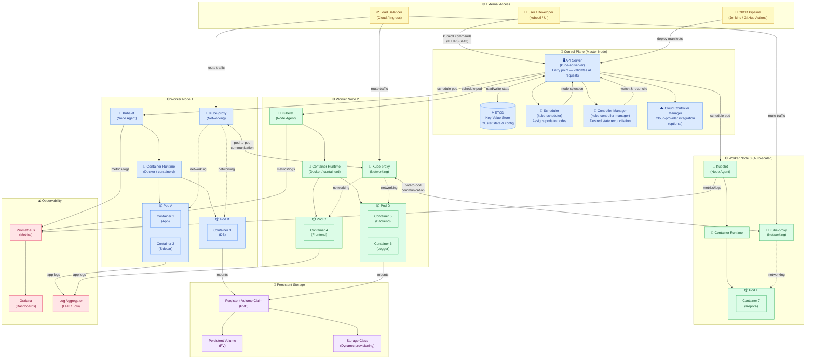

# Kubernetes Architecture Notes
> Based on Gate Smashers lecture transcript

---

## Introduction

- **Kubernetes** is a container **orchestration tool** used to manage thousands of containers at scale.
- Before learning Kubernetes, understanding **Docker and containers** is essential.
- The word *orchestration* comes from an **orchestra concert** — a master conductor manages all musicians; similarly, Kubernetes manages all containers.

---

## Why Do We Need Kubernetes?

| Scenario | Without Kubernetes | With Kubernetes |
|---|---|---|
| 2–4 containers | Easy to manage manually | Overkill |
| Thousands of containers | Chaotic, unmanageable | Fully automated |
| Scaling required | Manual intervention | Auto-scaling |
| Load balancing needed | Manual setup | Built-in |
| Node/pod failure | Manual recovery | Auto-recovery |

- In a **CI/CD pipeline**, new deployments and changes happen continuously — Kubernetes automates all of this.

---

## Production Architecture Diagram

**Diagram Key:**
| Colour | Zone |
|---|---|
| 🔵 Blue | Control Plane (Master Node) & Worker Node 1 |
| 🟢 Green | Worker Nodes 2 & 3 |
| 🟡 Yellow | External access (users, CI/CD, load balancer) |
| 🟣 Purple | Persistent storage layer |
| 🔴 Red | Observability (Prometheus, Grafana, logging) |

- **Cluster** = Collection of nodes (master + workers), like a hotel.
- **Node** = A physical or virtual server.
- **Pod** = Smallest deployable unit; contains one or more containers.
- **Persistent Volume (PV/PVC)** = Durable storage that survives pod restarts.
- **Cloud Controller Manager** = Optional component that integrates with AWS/GCP/Azure APIs.

---

## Master Node Components

### 1. API Server
- **Entry point** for all client requests (via UI or CLI).
- Acts like the **reception area** of a hotel.
- Validates syntax and authenticates requests before processing.

### 2. ETCD
- A **key-value pair database**.
- Stores the **entire cluster state**: which nodes exist, which pods are running, which have availability.
- Like the hotel's **booking register** — checks room availability.

### 3. Scheduler
- Decides **which pod gets allocated** to which worker node, based on resource availability (CPU, memory).
- Like the **hotel manager** who assigns you to Room 501.
- After allocation, the assignment is saved back to ETCD.

### 4. Control Manager
- Monitors the **health and state** of the cluster continuously.
- If a pod fails, it **replicates or reschedules** it on a new pod/node.
- Ensures the **desired state matches the actual state** — like ensuring a hotel guest has water, electricity, and services throughout their stay.

---

## Worker Node Components

### 5. Kubelet
- A **node agent** running on every worker node.
- Watches the API server for assigned pods and **deploys the container** into the allocated pod.
- Like **room service** — escorts your luggage to Room 501 and sets everything up.
- Continuously checks that pods are **running and healthy**.

### 6. Kube-proxy
- Handles **networking and load balancing** between pods.
- Enables **pod-to-pod communication** (like a walkie-talkie/phone system between hotel rooms).
- Prevents overload — ensures no single pod is overwhelmed while another sits idle.

### 7. Container Runtime
- The engine that actually **runs the containers** (e.g., Docker).
- Controls when containers start, stop, and pause.
- Manages the underlying **CPU and memory** usage.

---

## Real-Life Hotel Analogy Summary

| Kubernetes Component | Hotel Analogy |
|---|---|
| Cluster | The entire hotel |
| Master Node | Hotel headquarters / management |
| Worker Node | Individual floors / sections |
| Pod | A hotel room |
| Container | Guest (with luggage/dependencies) |
| API Server | Reception desk |
| ETCD | Booking register / database |
| Scheduler | Hotel manager assigning rooms |
| Control Manager | Operations manager (ensures guest happiness) |
| Kubelet | Room service / bellboy |
| Kube-proxy | Internal phone/walkie-talkie network |
| Container Runtime | Actual room infrastructure (electricity, water) |

---

## Request Flow — Step by Step

1. **Client** sends a deploy request via UI or CLI.
2. Request hits the **API Server** → validates the request.
3. **ETCD** is queried → checks available resources in the cluster.
4. **Scheduler** allocates an appropriate **Pod** on a worker node.
5. Allocation is saved back to **ETCD**.
6. **API Server** forwards the instruction to the worker node.
7. **Kubelet** (on the worker node) receives the instruction and deploys the container into the pod.
8. **Kube-proxy** sets up networking so pods can communicate and balances load.
9. **Control Manager** continuously monitors — if anything fails, it self-heals.

---

## Key Takeaways

- Kubernetes is essential when managing **large-scale containerized applications**.
- The **master node** orchestrates everything; **worker nodes** do the actual work.
- Every component has a clear, single responsibility.
- The system is **self-healing** — failed pods are automatically restarted or rescheduled.
- Kubernetes integrates naturally into **DevOps CI/CD pipelines**.

---

*Source: Gate Smashers — Kubernetes Architecture lecture*
